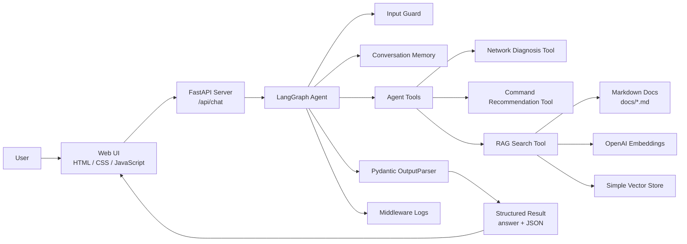
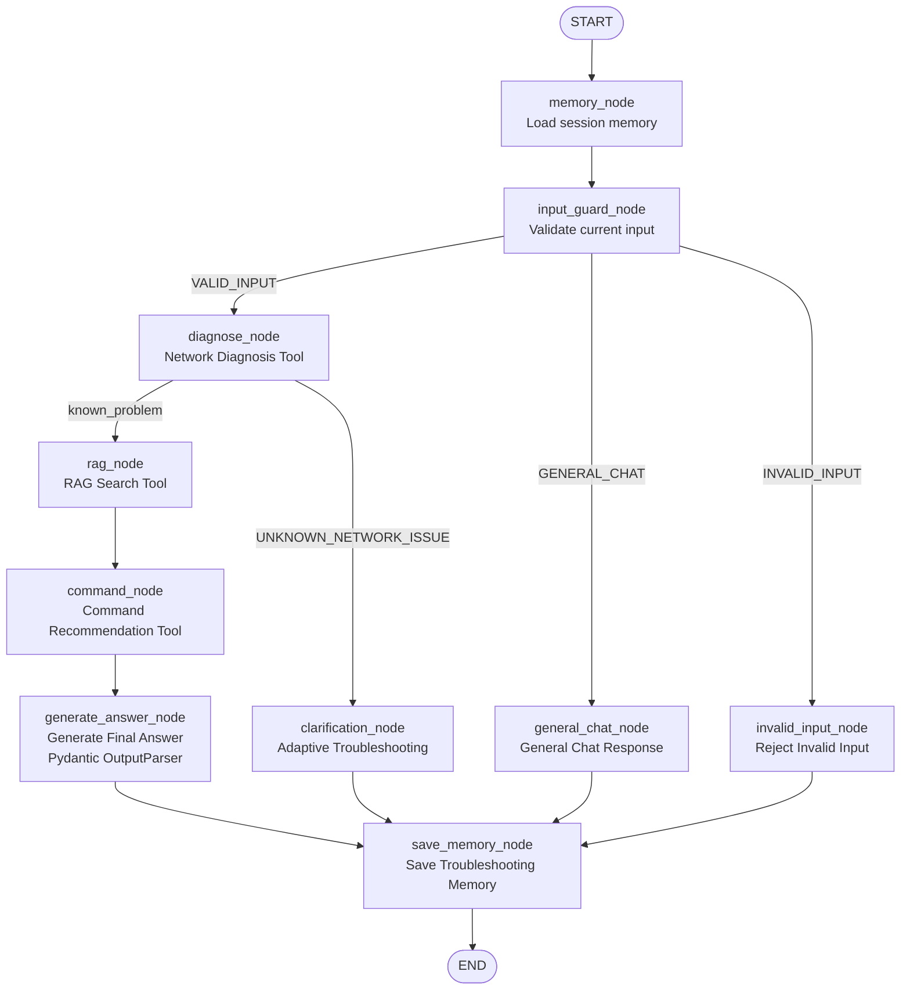

<div align="center">

# Network Troubleshooting Agent

### LangChain / LangGraph 기반 네트워크 장애 진단 Agent 서비스

사용자의 자연어 네트워크 장애 상황을 입력받아  
Agent가 진단 Tool, RAG 문서 검색, 명령어 추천, Memory를 활용해  
원인 후보와 다음 점검 단계를 제안하는 AI 서비스입니다.

<br>


</div>

<br>

---

## 목차

- [1. 프로젝트 소개](#1-프로젝트-소개)
- [2. 문제 정의](#2-문제-정의)
- [3. 사용 시나리오](#3-사용-시나리오)
- [4. 주요 기능](#4-주요-기능)
- [5. 전체 아키텍처](#5-전체-아키텍처)
- [6. LangGraph Workflow](#6-langgraph-workflow)
- [7. Core Components](#7-core-components)
- [8. 프로젝트 구조](#8-프로젝트-구조)
- [9. 설치 및 실행 방법](#9-설치-및-실행-방법)
- [10. API Endpoints](#10-api-endpoints)
- [11. 테스트 예시](#11-테스트-예시)
- [12. 한계점 및 향후 개선 방향](#12-한계점-및-향후-개선-방향)

---

## 1. 프로젝트 소개

**Network Troubleshooting Agent**는 사용자가 겪는 네트워크 장애 상황을 자연어로 입력하면,  
LangGraph 기반 Agent가 문제 유형을 분류하고, 관련 문서를 검색하며,  
사용자가 직접 확인할 수 있는 점검 명령어와 다음 질문을 생성하는 서비스입니다.

예를 들어 사용자는 아래와 같이 질문할 수 있습니다.

```text
IP로는 접속되는데 도메인으로는 접속이 안 돼요.
```

```text
서버에 SSH 접속이 안 돼요. ping은 됩니다.
```

```text
수동 IP를 설정했는데 재부팅하면 DHCP로 받은 IP로 바뀌어요.
```

```text
Docker 컨테이너에서 인터넷이 안 됩니다.
```

Agent는 단순히 일반 답변을 생성하는 것이 아니라,  
입력 검증, 장애 유형 분류, RAG 검색, 명령어 추천, 구조화 출력, 메모리 저장 여부 판단을 포함한  
하나의 실행 흐름으로 동작합니다.

---

## 2. 문제 정의

네트워크 장애는 초보자가 원인을 바로 파악하기 어렵습니다.

특히 다음과 같은 문제가 자주 발생합니다.

- SSH 접속 실패
- DNS 해석 실패
- DHCP 주소 할당 문제
- 수동 IP 설정 미적용
- Gateway / Routing 문제
- Firewall / Port 차단
- Docker, VM, VPN 등 특수 환경에서의 네트워크 문제

이 프로젝트는 사용자가 장애 상황을 문장으로 입력하면,  
Agent가 상황을 단계적으로 좁혀가며 다음 확인 단계를 제안하는 것을 목표로 합니다.

---

## 3. 사용 시나리오

### Scenario 1. DNS 장애 진단

```text
User: IP로는 되는데 도메인으로는 접속이 안 돼요.
AI: DNS 설정 또는 DNS 서버 응답 문제일 가능성이 높습니다.
    nslookup google.com, cat /etc/resolv.conf 등을 확인해보세요.
```

### Scenario 2. 멀티턴 대화

```text
User: 그럼 DNS 서버 주소는 어디서 확인해요?
AI: /etc/resolv.conf 또는 systemd-resolve --status에서 확인할 수 있습니다.
```

이전 질문의 DNS 문맥을 Memory로 유지하여 후속 질문에 대응합니다.

### Scenario 3. 수동 IP 설정 문제

```text
User: 수동 IP를 설정했는데 재부팅하면 다른 IP로 바뀌어요.
AI: DHCP 서버 장애라기보다 NetworkManager connection profile이 manual로 적용되지 않았을 가능성이 있습니다.
```

### Scenario 4. 일반 대화와 진단 분리

```text
User: 해결해줘서 고마워.
AI: 도움이 되어 다행입니다. 네트워크 관련 문제가 있으면 다시 알려주세요.
```

일반 대화는 네트워크 진단 흐름으로 보내지 않고, Memory에도 저장하지 않습니다.

---

## 4. 주요 기능

| 기능 | 설명 |
|---|---|
| 자연어 네트워크 장애 입력 | 사용자가 네트워크 문제를 문장으로 입력 |
| Input Guard | 일반 대화, invalid input, 네트워크 진단 입력 구분 |
| LangGraph StateGraph | Agent 실행 흐름을 노드와 조건부 분기로 구성 |
| Network Diagnosis Tool | 사용자의 장애 유형 분류 |
| Command Recommendation Tool | 장애 유형별 점검 명령어 추천 |
| RAG Search Tool | 내부 Markdown 문서 검색 |
| Memory | session_id 기반 멀티턴 대화 유지 |
| Middleware | 요청 로그, LLM/Tool 호출 제한, 완료/에러 로그 |
| OutputParser | Pydantic 기반 구조화 JSON 출력 |
| Web UI | Chat, Diagnosis, Trace, Evidence 패널 제공 |

---

## 5. 전체 아키텍처



### Architecture Summary

1. 사용자는 Web UI에서 네트워크 장애 상황을 입력합니다.
2. FastAPI 서버는 `/api/chat` 요청을 받아 LangGraph Agent를 실행합니다.
3. Agent는 입력을 검증하고, 네트워크 진단이 필요한지 판단합니다.
4. 네트워크 문제라면 진단 Tool, RAG Tool, 명령어 추천 Tool을 실행합니다.
5. LLM은 Tool 결과와 RAG 검색 결과를 바탕으로 최종 답변을 생성합니다.
6. OutputParser는 답변을 Pydantic 기반 JSON 구조로 정리합니다.
7. 필요한 대화만 Memory에 저장하여 멀티턴 대화를 지원합니다.
8. Middleware는 요청, Tool 호출, LLM 호출, 에러, 완료 로그를 기록합니다.

---

## 6. LangGraph Workflow



### Workflow Description

| Node | 역할 |
|---|---|
| `memory_node` | session_id에 해당하는 이전 대화 이력을 불러옴 |
| `input_guard_node` | 현재 입력이 네트워크 진단 대상인지 판단 |
| `diagnose_node` | 네트워크 장애 유형 분류 |
| `rag_node` | 관련 트러블슈팅 문서 검색 |
| `command_node` | 장애 유형별 점검 명령어 추천 |
| `generate_answer_node` | RAG, Tool, Memory 기반 최종 답변 생성 |
| `clarification_node` | 준비된 유형에 딱 맞지 않는 네트워크 문제 처리 |
| `general_chat_node` | 일반 대화 응답 |
| `invalid_input_node` | 의미 없는 입력 차단 |
| `save_memory_node` | 필요한 대화만 Memory에 저장 |

---

## 7. Core Components

## 7.1 Tools

본 프로젝트는 다음 3개의 Tool을 사용합니다.

### 1. Network Diagnosis Tool

사용자 질문을 분석하여 네트워크 장애 유형을 분류합니다.

대표 문제 유형:

```text
SSH_CONNECTION_FAILED
STATIC_IP_NOT_APPLIED
DHCP_LEASE_FAILED
DNS_RESOLUTION_FAILED
PING_CONNECTIVITY_CHECK
INTERNET_CONNECTION_FAILED
FIREWALL_OR_PORT_BLOCKED
GATEWAY_OR_ROUTING_ISSUE
UNKNOWN_NETWORK_ISSUE
```

예시:

```text
"IP로는 되는데 도메인으로는 접속이 안 돼요"
→ DNS_RESOLUTION_FAILED
```

```text
"수동 IP를 설정했는데 재부팅하면 DHCP IP로 바뀌어요"
→ STATIC_IP_NOT_APPLIED
```

---

### 2. Command Recommendation Tool

진단된 장애 유형에 따라 사용자가 직접 확인할 수 있는 명령어를 추천합니다.

예시:

| Problem Type | Recommended Commands |
|---|---|
| `DNS_RESOLUTION_FAILED` | `nslookup google.com`, `cat /etc/resolv.conf` |
| `SSH_CONNECTION_FAILED` | `systemctl status sshd`, `ss -tulnp \| grep :22` |
| `STATIC_IP_NOT_APPLIED` | `nmcli con show`, `nmcli con reload`, `ip addr` |
| `FIREWALL_OR_PORT_BLOCKED` | `firewall-cmd --list-all`, `ss -tulnp` |

---

### 3. RAG Search Tool

`docs/*.md`에 저장된 네트워크 트러블슈팅 문서를 검색합니다.

검색 흐름:

```text
Markdown Documents
→ Text Split
→ OpenAI Embedding
→ Simple Vector Store
→ Similarity Search
→ RAG Context
```

RAG는 단순 답변 생성을 넘어,  
장애 상황별 원인 후보와 명령어 선택 근거를 제공합니다.

---

## 7.2 RAG Pipeline

본 프로젝트의 RAG는 외부 웹 검색이 아니라,  
직접 작성한 네트워크 트러블슈팅 Markdown 문서를 기반으로 합니다.

### RAG 대상 문서

```text
docs/
├─ dhcp_troubleshooting.md
├─ dns_troubleshooting.md
├─ firewall_ports.md
├─ gateway_routing.md
├─ network_infrastructure.md
└─ ssh_troubleshooting.md
```

### RAG 처리 방식

| 단계 | 설명 |
|---|---|
| Load | `docs` 폴더의 Markdown 파일 로드 |
| Split | `RecursiveCharacterTextSplitter`로 문서 chunk 분리 |
| Embed | `OpenAIEmbeddings(text-embedding-3-small)` 사용 |
| Store | SimpleVectorStore에 embedding 저장 |
| Search | 사용자 질문과 유사한 문서 chunk 검색 |
| Generate | 검색 결과를 최종 답변 프롬프트에 포함 |

---

## 7.3 Memory

Memory는 `session_id`를 기준으로 분리됩니다.

```text
session_id = "default"
session_id = "dns-test"
session_id = "static-ip-test"
```

각 세션은 독립된 대화 이력을 유지합니다.

### Memory 저장 정책

모든 입력을 저장하지 않고,  
네트워크 진단에 필요한 대화만 저장합니다.

| 입력 유형 | 저장 여부 |
|---|---|
| 네트워크 장애 질문 | 저장 |
| 네트워크 후속 질문 | 저장 |
| 일반 대화 | 저장하지 않음 |
| 감사 인사 | 저장하지 않음 |
| 의미 없는 입력 | 저장하지 않음 |

이 정책을 통해 불필요한 대화가 다음 진단에 영향을 주는 문제를 줄였습니다.

---

## 7.4 Middleware

운영 관점의 안정성을 위해 여러 Middleware 성격의 함수를 적용했습니다.

| Middleware | 역할 |
|---|---|
| `request_logging_middleware` | Agent 요청 시작 로그 기록 |
| `model_call_limit_middleware` | LLM 호출 횟수 기록 및 제한 |
| `tool_call_limit_middleware` | Tool 호출 횟수 기록 및 제한 |
| `agent_finish_logging_middleware` | Agent 실행 완료 로그 기록 |
| `agent_error_logging_middleware` | Agent 실행 중 에러 로그 기록 |
| `outputParserFallback` | OutputParser 실패 시 fallback 로그 기록 |

Middleware 로그는 API 응답과 `/api/middleware/logs`에서 확인할 수 있습니다.

---

## 7.5 OutputParser

최종 응답은 `PydanticOutputParser`를 통해 구조화됩니다.

```python
class DiagnosisResult(BaseModel):
    problem_type: str
    possible_causes: List[str]
    recommended_commands: List[str]
    next_question: str
    user_facing_answer: str
```

API 응답에는 자연어 답변과 구조화 결과가 함께 포함됩니다.

```json
{
  "answer": "...",
  "structured_result": {
    "problem_type": "DNS_RESOLUTION_FAILED",
    "possible_causes": [],
    "recommended_commands": [],
    "next_question": "...",
    "user_facing_answer": "..."
  }
}
```

---

## 8. 프로젝트 구조

```text
ai-service-project/
├─ server.py
├─ requirements.txt
├─ .env.example
├─ .gitignore
├─ README.md
│
├─ docs/
│  ├─ dhcp_troubleshooting.md
│  ├─ dns_troubleshooting.md
│  ├─ firewall_ports.md
│  ├─ gateway_routing.md
│  ├─ network_infrastructure.md
│  └─ ssh_troubleshooting.md
│
└─ public/
   ├─ index.html
   ├─ css/
   │  └─ style.css
   └─ js/
      ├─ api.js
      ├─ ui.js
      └─ main.js
```

---

## 9. 설치 및 실행 방법

## 9.1 Clone Repository

```bash
git clone https://github.com/mickseogi/ai-service-project.git
cd ai-service-project
```

---

## 9.2 Install Dependencies

`requirements.txt`에 작성된 패키지를 설치합니다.

```bash
pip install -r requirements.txt
```

설치되는 주요 패키지는 다음과 같습니다.

```text
fastapi
uvicorn[standard]
python-dotenv
langchain
langchain-openai
langchain-text-splitters
langgraph
```

---

## 9.3 Set Environment Variables

프로젝트 루트에 있는 `.env.example` 파일의 이름을 `.env`로 변경합니다.

```text
.env.example
→ .env
```

그 다음 `.env` 파일을 열고 OpenAI API Key를 입력합니다.

```env
OPENAI_API_KEY=your_openai_api_key_here
```

API Key는 코드에 직접 작성하지 않고 `.env` 파일로 분리 관리합니다.

---

## 9.4 Run Server

아래 명령어로 FastAPI 서버를 실행합니다.

```bash
uvicorn server:app --reload
```

서버 실행 후 아래 주소로 접속합니다.

```text
http://127.0.0.1:8000
```

Swagger API 문서는 아래 주소에서 확인할 수 있습니다.

```text
http://127.0.0.1:8000/docs
```

---

## 10. API Endpoints

| Method | Endpoint | Description |
|---|---|---|
| `GET` | `/` | Web UI |
| `GET` | `/api/health` | 서버 상태 확인 |
| `POST` | `/api/chat` | Agent 질의 실행 |
| `POST` | `/api/memory/reset` | 세션 Memory 초기화 |
| `GET` | `/api/memory/history` | 세션 Memory 조회 |
| `GET` | `/api/middleware/logs` | Middleware 로그 조회 |
| `POST` | `/api/middleware/reset` | Middleware 로그 초기화 |
| `POST` | `/api/middleware/config` | Middleware 제한 설정 변경 |

---

## 10.1 Chat API Example

### Request

```json
{
  "session_id": "dns-test",
  "question": "IP로는 되는데 도메인으로는 접속이 안 돼요"
}
```

### Response

```json
{
  "success": true,
  "question": "IP로는 되는데 도메인으로는 접속이 안 돼요",
  "memory_used": true,
  "memory_saved": true,
  "answer": "도메인 이름으로 접속이 안 되는 문제는 DNS 설정과 관련이 있을 수 있습니다...",
  "structured_result": {
    "problem_type": "DNS_RESOLUTION_FAILED",
    "possible_causes": [
      "DNS 서버 주소가 잘못 설정되어 있다.",
      "DNS 서버가 응답하지 않는다."
    ],
    "recommended_commands": [
      "nslookup google.com",
      "cat /etc/resolv.conf"
    ],
    "next_question": "현재 사용 중인 DNS 서버 주소는 무엇인가요?",
    "user_facing_answer": "..."
  },
  "graph_used": true,
  "graph_flow": [
    "START",
    "memory_node",
    "input_guard_node",
    "diagnose_node",
    "conditional_edge:known_problem",
    "rag_node",
    "command_node",
    "generate_answer_node",
    "save_memory_node",
    "END"
  ]
}
```

---

## 11. 테스트 예시

## 11.1 DNS 문제

```text
IP로는 되는데 도메인으로는 접속이 안 돼요
```

기대 동작:

```text
DNS_RESOLUTION_FAILED
→ RAG Search
→ nslookup / resolv.conf 확인 제안
```

---

## 11.2 DNS 후속 질문

```text
그럼 DNS 서버 주소는 어디서 확인해요?
```

기대 동작:

```text
이전 DNS 문맥 유지
→ /etc/resolv.conf 또는 systemd-resolve 확인 안내
```

---

## 11.3 수동 IP 설정 문제

```text
지금 IP를 수동으로 192.168.56.50으로 설정했는데 재부팅하면 자꾸 다른 IP로 바뀌어. 무슨 문제야?
```

기대 동작:

```text
STATIC_IP_NOT_APPLIED
→ DHCP 서버 장애로 단정하지 않음
→ NetworkManager connection profile 확인
→ ipv4.method manual 확인
```

---

## 11.4 Docker 네트워크 문제

```text
Docker 컨테이너에서 인터넷이 안 돼요
```

기대 동작:

```text
UNKNOWN_NETWORK_ISSUE
→ Adaptive Troubleshooting
→ docker exec, ping, nslookup, resolv.conf 확인 제안
```

---

## 11.5 일반 대화

```text
해결해줘서 고마워
```

기대 동작:

```text
GENERAL_CHAT
→ 진단 Tool 실행하지 않음
→ Memory 저장하지 않음
```

---

## 11.6 의미 없는 입력

```text
ㅁㅁㅁㅁㅁㅁㅁㅁㅁㅁㅁㅁㅁㅁㅁㅁㅁㅁㅁㅁㅁㅁㅁㅁ
```

기대 동작:

```text
INVALID_INPUT
→ 진단 실행하지 않음
→ Memory 저장하지 않음
```

---

## 12. 한계점 및 향후 개선 방향

## 12.1 한계점

- RAG 문서는 직접 작성한 Markdown 문서에 한정됩니다.
- 외부 검색 Tool은 포함하지 않았습니다.
- InMemory 기반 Memory이므로 서버 재시작 시 대화 이력은 초기화됩니다.

---

## 12.2 향후 개선 방향

- SQLite 또는 Redis 기반 Memory 저장
- 실제 명령어 실행 결과를 안전하게 수집하는 진단 Tool 추가
- OS별 명령어 추천 고도화
  - Windows
  - Linux
  - macOS
  - OpenWrt
- Docker / VM / VPN 환경별 별도 진단 흐름 추가
- RAG 문서 자동 업데이트 및 문서별 metadata 강화
- LangGraph 반복 loop 기반 추가 진단 흐름 구현
- 관리자용 로그 대시보드 개선

---

## Tech Summary

| Category | Stack |
|---|---|
| Backend | FastAPI |
| Agent Framework | LangChain, LangGraph |
| LLM | OpenAI GPT-4o mini |
| Embedding | text-embedding-3-small |
| RAG Store | Custom SimpleVectorStore |
| Memory | InMemoryChatMessageHistory |
| Output | PydanticOutputParser |
| Frontend | HTML, CSS, JavaScript |
| Config | python-dotenv |

---

## Author

## Author

| 항목 | 내용 |
|---|---|
| 작성자 | 서민석 |
| 학번 | 2022041045 |
| 과목 | AI Service Design and Implementation Practice |
| 프로젝트 | Network Troubleshooting Agent |

<br>

<div align="center">

### Network Troubleshooting Agent

LangChain과 LangGraph를 활용한  
대화형 네트워크 장애 진단 Agent 서비스

</div>


